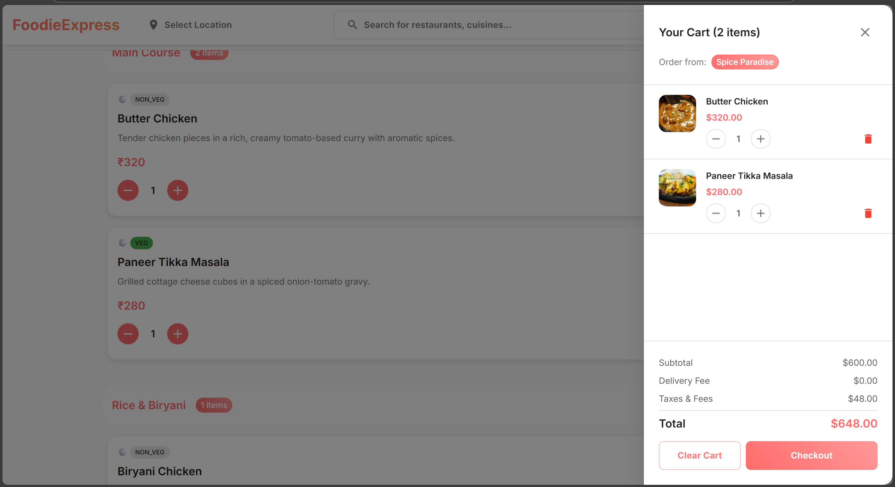

FoodieExpress - Complete Food Delivery Platform

Author: Mouni Varshini

Project Overview:

FoodieExpress is a sophisticated, full-stack food delivery application designed to replicate the functionality of industry-leading platforms like Swiggy and Zomato. This comprehensive solution demonstrates modern web development practices, featuring a robust backend architecture, intuitive user interfaces, and seamless user experiences across multiple roles.

The application serves as a complete ecosystem connecting customers, restaurants, delivery partners, and administrators through a unified platform. With real-time order tracking, secure payment processing, and responsive design, FoodieExpress showcases enterprise-level development capabilities and attention to user experience details.

Key Features & Capabilities:

- Multi-Role Authentication System: Secure JWT-based authentication supporting customers, restaurant owners, delivery partners, and administrators
- Real-Time Order Management: Live order tracking with status updates and notifications across all user types
- Advanced Restaurant Discovery: Smart search functionality with filters for cuisine, rating, delivery time, and location
- Comprehensive Menu Management: Dynamic menu systems with categories, pricing, availability, and customization options
- Secure Payment Integration: Multiple payment methods with transaction security and order history
- Location-Based Services: GPS integration for accurate delivery addresses and restaurant proximity calculations
- Responsive Cross-Platform Design: Optimized user experience across desktop, tablet, and mobile devices
- Administrative Dashboard: Complete system oversight with analytics, user management, and platform monitoring

Technologies & Tools Used

Backend Technologies:
- Java 11 - Core programming language providing robust, scalable foundation
- Spring Boot 2.7 - Enterprise-grade framework for rapid application development
- Spring Security - Comprehensive security framework with JWT token management
- Spring Data JPA - Advanced data persistence with object-relational mapping
- H2 Database - In-memory database for development and demonstration
- Maven - Dependency management and build automation
- Hibernate - Object-relational mapping and database abstraction

Frontend Technologies
- React 18 - Modern JavaScript library with functional components and hooks
- Material-UI (MUI) - Professional React component library for consistent design
- Redux Toolkit - Predictable state management for complex application state
- React Router v6 - Declarative routing with modern navigation patterns
- Axios - Promise-based HTTP client for API communication
- React Hook Form - Performant forms with easy validation

Development & Build Tools
- Node.js & npm - JavaScript runtime and package management
- Create React App - Development environment and build optimization
- JWT (JSON Web Tokens) - Stateless authentication and authorization
- CORS Configuration - Cross-origin resource sharing for API security
- RESTful API Design - Scalable web service architecture

Application Screenshots & Features Walkthrough

The following screenshots demonstrate the complete user journey and functionality of FoodieExpress:

1. Homepage - Welcome Interface

The landing page features an elegant design with restaurant categories, featured offers, and quick access to popular cuisines. Users can immediately browse available restaurants or start their food discovery journey with intuitive navigation elements.

2. Restaurant Listings - Discover Local Favorites  

Comprehensive restaurant directory displaying diverse cuisine options with ratings, delivery times, and special offers. The clean layout makes it easy for users to compare restaurants and make informed dining decisions.

3. Complete Homepage Experience

The complete homepage showcase demonstrates the full user interface with restaurant cards, search functionality, and category filters. This provides users with a comprehensive view of all available dining options in their area.

4. Restaurant Details - In-Depth Information

Detailed restaurant pages feature comprehensive information including menu categories, customer reviews, restaurant images, and essential details like operating hours and delivery fees for informed decision-making.

5. User Registration - Account Creation

Streamlined registration process with user-friendly form validation and clear input fields. The interface guides new users through account creation with minimal friction and maximum security.

6. Successful Account Creation

Confirmation interface displaying successful account registration with next steps. Users receive immediate feedback and guidance on how to proceed with their food ordering experience.

7. Food Ordering Process - Menu Selection

Interactive menu interface allowing users to browse categories, view item details, and customize orders. The intuitive design makes food selection enjoyable and efficient with clear pricing and descriptions.

8. Restaurant Menu Display

Comprehensive menu presentation with organized categories, high-quality food images, and detailed descriptions. Users can easily navigate through different food sections and make selections based on preferences and dietary requirements.

9. Multiple Item Selection

Shopping cart functionality demonstrating multiple item selection with quantity controls and real-time price calculation. Users can easily modify their orders and see instant updates to their total amount.

10. Shopping Cart Management

Complete cart interface showing selected items, quantities, individual prices, and order summary. Users can review their selections, make modifications, and proceed to checkout with confidence.

11. Delivery Address Setup

Location input interface allowing users to specify delivery addresses with accurate details. The system ensures proper address formatting and validation for successful order delivery.

12. Payment Information Entry

Secure payment interface supporting multiple payment methods with encrypted data handling. Users can confidently enter payment information knowing their financial data is protected.

13. Order Review & Checkout

Comprehensive checkout page displaying order summary, delivery details, payment information, and final pricing. Users can review all aspects of their order before final confirmation.

14. Order Confirmation & Processing

Order confirmation interface showing successful order placement with order tracking information. Users receive immediate confirmation and estimated delivery times for their food orders.

15. User Profile Management

Personal profile interface allowing users to manage account information, saved addresses, order history, and preferences. This provides a personalized experience and convenient account management capabilities.

Why FoodieExpress?..

FoodieExpress represents a complete understanding of modern web application development, showcasing expertise in full-stack development, user experience design, and enterprise-level architecture. The application demonstrates proficiency in industry-standard technologies while delivering a polished, production-ready solution.

Developed with passion and precision by Mouni Varshini